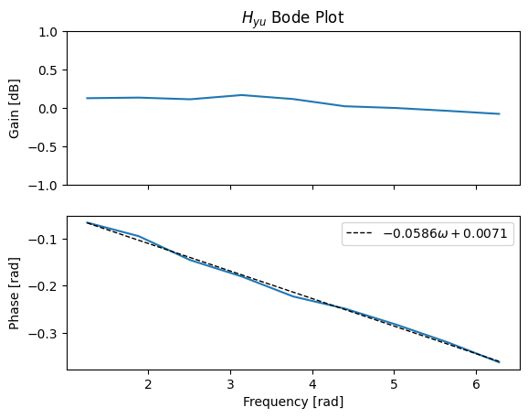

# MouseLatencyCalculator

Calculates the latency between mouse inputs and the display from a browser
window using screen capture and signal processing.

The computation assumes that each frame of the output is displayed by
the browser as a white dot on a black background.

The inputs are a broad spectrum sinuosoid at sample frequencies spaced 0.1 Hz
apart. The latency is calculated using digital signal processing. The
transfer function between the output and input is computed using the FFT.
The phase delay is assumed to be linear and fitted to a line. The slope
of the line represents the time delay in seconds.

